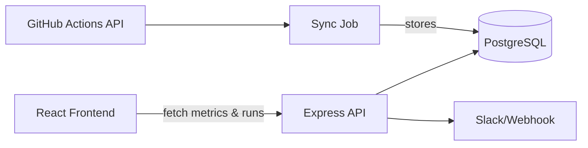

# Tech Design Document

## High-Level Architecture
1. A scheduled **sync job** in the backend calls the GitHub Actions API and pulls the latest workflow runs.
2. Runs are cached in memory to reduce API calls and persisted in **PostgreSQL** for historical queries.
3. The **Express API** serves aggregated metrics and run details from the database.
4. The **React frontend** periodically polls the API to render dashboard widgets.
5. When a run fails, the backend's alert service posts a message to the configured **Slack webhook**.



## API Structure
### `GET /api/metrics/summary`
Aggregated metrics for recent workflow runs.

```json
{
  "successRate": 92,
  "failureRate": 8,
  "avgBuildTime": "3:12",
  "lastBuildStatus": "success"
}
```

### `GET /api/builds?limit=20`
Returns a list of the most recent workflow runs. `limit` controls the number returned.

```json
[
  {
    "id": 123,
    "workflowName": "CI",
    "branch": "main",
    "status": "completed",
    "conclusion": "success",
    "duration": 192,
    "timestamp": "2023-10-10T12:00:00Z"
  }
]
```

### `GET /api/builds/:id`
Detailed data for a single workflow run.

```json
{
  "id": 123,
  "workflowName": "CI",
  "branch": "main",
  "status": "completed",
  "conclusion": "success",
  "duration": 192,
  "timestamp": "2023-10-10T12:00:00Z",
  "htmlUrl": "https://github.com/.../runs/123"
}
```

### `GET /api/builds/:id/log`
Retrieve log output for the specified run.

```json
{
  "log": "..."
}
```

## Database Schema
The backend uses Prisma ORM. The `WorkflowRun` model stores metadata for every GitHub Actions run.

```prisma
// prisma/schema.prisma
model WorkflowRun {
  id           Int       @id @default(autoincrement())
  runId        BigInt    @unique
  repoName     String
  workflowName String
  headBranch   String
  status       String
  conclusion   String?
  duration     Int       // seconds
  htmlUrl      String
  runAt        DateTime
}
```

## UI Layout
The React frontend is structured with reusable functional components.

```
App
 └─ Dashboard
     ├─ SummaryPanel
     │   ├─ MetricCard (Success Rate)
     │   ├─ MetricCard (Avg Build Time)
     │   └─ MetricCard (Last Build Status)
     ├─ BuildList
     │   └─ BuildItem*
     └─ Charts
         ├─ SuccessFailurePie
         └─ BuildTimeLine
```
`BuildItem*` opens a modal displaying detailed info and logs fetched on demand.

### Wireframe Overview
- **Summary Panel:** top section with large numeric metrics.
- **Build List:** table of recent runs showing status (color coded), branch, duration, and timestamp.
- **Charts:** visualizations for success/failure distribution and build time trends.
- **Detail Modal:** slide-in or modal showing run metadata and log snippet when a build row is clicked.

## Alert Flow
1. Backend fetches new runs from GitHub API.
2. If a run concludes with failure, alert service posts a message to Slack webhook containing repo, workflow, branch, and URL.
3. Alerts are idempotent; duplicate notifications for the same run are avoided.
