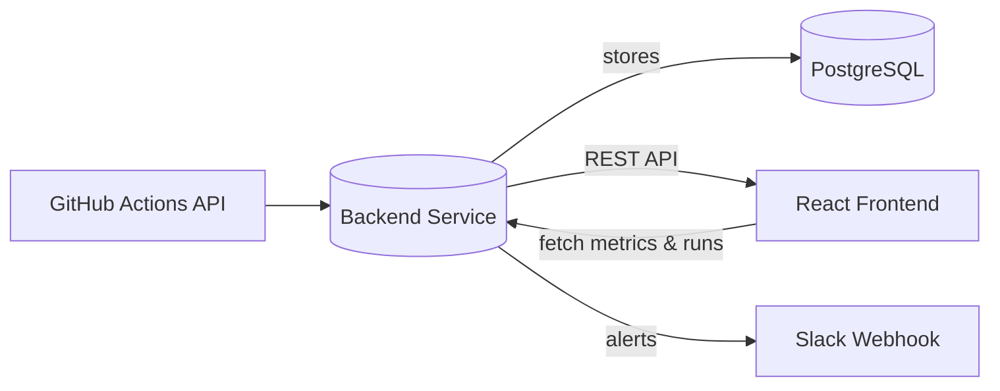

# Tech Design Document

## High-Level Architecture
The system periodically retrieves workflow run data from the GitHub Actions API, persists it in PostgreSQL, and serves metrics and run details via an Express.js API. A React frontend consumes this API to render a dashboard. On failed runs, the backend sends alerts through a configurable Slack webhook.



## API Structure
| Route | Method | Description | Sample Response |
|-------|--------|-------------|-----------------|
| `/api/metrics/summary` | GET | Return success rate, failure rate, average duration, and last build status. | `{ "successRate": 92, "failureRate": 8, "avgBuildTime": "3:12", "lastBuildStatus": "success" }` |
| `/api/builds` | GET | List recent workflow runs. Supports `limit` query param. | `[ { "id": 123, "workflowName": "CI", "branch": "main", "status": "completed", "conclusion": "success", "duration": 192, "timestamp": "2023-10-10T12:00:00Z" } ]` |
| `/api/builds/:id` | GET | Detailed data for a single workflow run. | `{ "id": 123, "workflowName": "CI", "branch": "main", "status": "completed", "conclusion": "success", "duration": 192, "timestamp": "2023-10-10T12:00:00Z", "htmlUrl": "https://github.com/..." }` |
| `/api/builds/:id/log` | GET | Retrieve log text for the run. | `{ "log": "..." }` |

## Database Schema
The backend uses Prisma ORM. The `WorkflowRun` model captures metadata for each run.

```prisma
// prisma/schema.prisma
model WorkflowRun {
  id           Int       @id @default(autoincrement())
  runId        Int       @unique
  repoName     String
  workflowName String
  headBranch   String
  status       String
  conclusion   String?
  duration     Int       // seconds
  htmlUrl      String
  runAt        DateTime
}
```

## UI Layout
The React frontend is structured with reusable functional components.

```
App
 └─ Dashboard
     ├─ SummaryPanel
     │   ├─ MetricCard (Success Rate)
     │   ├─ MetricCard (Avg Build Time)
     │   └─ MetricCard (Last Build Status)
     ├─ BuildList
     │   └─ BuildItem*
     └─ Charts
         ├─ SuccessFailurePie
         └─ BuildTimeLine
```
`BuildItem*` opens a modal displaying detailed info and logs fetched on demand.

### Wireframe Overview
- **Summary Panel:** top section with large numeric metrics.
- **Build List:** table of recent runs showing status (color coded), branch, duration, and timestamp.
- **Charts:** visualizations for success/failure distribution and build time trends.

## Alert Flow
1. Backend fetches new runs from GitHub API.
2. If a run concludes with failure, alert service posts a message to Slack webhook containing repo, workflow, branch, and URL.
3. Alerts are idempotent; duplicate notifications for the same run are avoided.
